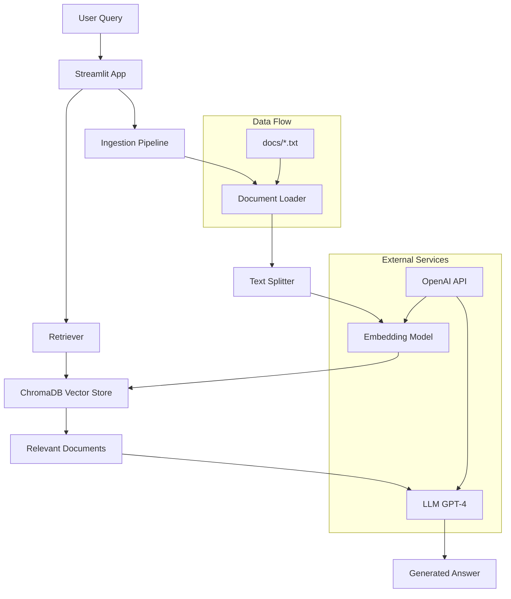

# Razek RAG System

[](https://github.com/abdulsamad245/razek-logistics-rag)

A Retrieval-Augmented Generation (RAG) system for querying internal company documents using natural language. This application allows users to ask questions about Razek's processes, policies, and operations based on the company's documentation.

## Features

- **Document Ingestion**: Automatically loads and processes text documents from a specified directory
- **Vector Search**: Uses ChromaDB with OpenAI embeddings for efficient document retrieval
- **Question Answering**: Leverages GPT-4 for generating accurate answers based on retrieved documents
- **Web Interface**: Streamlit-based chat interface with sample questions and conversation history
- **Modular Architecture**: Separated ingestion, retrieval, and application components

## Architecture



### Components

1. **Ingestion Pipeline** (`ingestion_pipeline.py`)
   - Loads text documents from the `docs/` directory
   - Splits documents into manageable chunks
   - Creates vector embeddings using OpenAI's text-embedding-3-small
   - Stores vectors in ChromaDB

2. **Retrieval Pipeline** (`retrieval_pipeline.py`)
   - Performs semantic search on the vector store
   - Retrieves top-k relevant document chunks
   - Generates answers using GPT-4 based on retrieved context

3. **Streamlit Application** (`streamlit_app.py`)
   - Provides web interface for user interaction
   - Manages chat history and session state
   - Automatically runs ingestion if vector store is missing
   - Includes sample questions for easy testing

4. **Test Script** (`test.py`)
   - Utility for inspecting stored documents in the vector database

## Setup Instructions

### Prerequisites

- Python 3.8+
- OpenAI API key
- Git (optional, for cloning)

### Installation

1. **Clone or download the repository**
   ```bash
   git clone https://github.com/abdulsamad245/razek-logistics-rag.git
   cd razek-logistics-rag
   ```

2. **Create a virtual environment** (recommended)
   ```bash
   python -m venv venv
   source venv/bin/activate  # On Windows: venv\Scripts\activate
   ```

3. **Install dependencies**
   ```bash
   pip install -r requirements.txt
   ```

4. **Set up environment variables**
   - Create a `.env` file in the root directory
   - Add your OpenAI API key:
     ```
     OPENAI_API_KEY=your-api-key-here
     ```

5. **Prepare documents**
   - Place your text documents in the `docs/` directory
   - Supported format: `.txt` files

### Running the Application

1. **Run the ingestion pipeline** (optional, runs automatically on first app launch)
   ```bash
   python ingestion_pipeline.py
   ```

2. **Start the Streamlit application**
   ```bash
   streamlit run streamlit_app.py
   ```

3. **Access the application**
   - Open your browser to `http://localhost:8501`

### Testing

- Run the test script to verify document storage:
  ```bash
  python test.py
  ```

- Use the retrieval pipeline directly:
  ```bash
  python retrieval_pipeline.py
  ```

## Configuration

Key configuration options can be modified in the respective files:

- **Vector Store**: `PERSIST_DIR = "db/chroma_db"` in `ingestion_pipeline.py`
- **Embedding Model**: `EMBEDDING_MODEL_NAME = "text-embedding-3-small"` in `streamlit_app.py`
- **LLM Model**: `LLM_MODEL_NAME = "gpt-4o"` in `streamlit_app.py`
- **Chunk Settings**: `chunk_size` and `chunk_overlap` in `split_documents()`
- **Retrieval**: `RETRIEVER_K = 7` for number of documents to retrieve

## File Structure

```
.
├── ingestion_pipeline.py      # Document ingestion and vectorization
├── retrieval_pipeline.py      # Document retrieval and QA
├── streamlit_app.py          # Web application interface
├── test.py                   # Database inspection utility
├── requirements.txt          # Python dependencies
├── .env                      # Environment variables (not in repo)
├── .gitignore               # Git ignore rules
├── README.md                # This file
├── assets/                  # Static assets (logos, etc.)
├── docs/                    # Document storage directory
└── db/                      # Vector database storage
    └── chroma_db/           # ChromaDB persistence directory
```

## Usage

1. **Ask Questions**: Type natural language questions in the chat input
2. **Use Samples**: Click sample questions in the sidebar for quick testing
3. **Review History**: Previous conversations are maintained in the chat

The system will:
- Search for relevant document sections
- Generate answers based only on the provided documents
- Indicate when information is not available in the documents

## Troubleshooting

- **No vector store found**: The ingestion pipeline will run automatically on first launch
- **API errors**: Verify your OpenAI API key in `.env`
- **Document loading issues**: Ensure documents are in `docs/` and are `.txt` format
- **Performance**: Adjust chunk size and retrieval parameters for your use case

## Contributing

1. Follow the existing code style and structure
2. Add type hints and docstrings for new functions
3. Test changes with the provided test script
4. Update documentation as needed

## License

This project is licensed under the MIT License - see the [LICENSE](LICENSE) file for details.